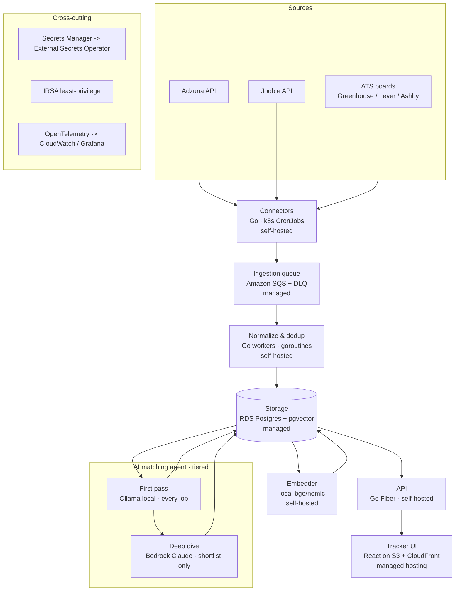

# Architecture — JobSonar

Hybrid architecture: buy the stateful/security-heavy, free-tier pieces; build the compute-heavy, portable, high-learning pieces; cascade inference so cost tracks value.

## Diagram

*(A rendered version of this hybrid diagram was produced during design; this mermaid block is the portable, in-repo source of truth.)*

## Data flow (happy path)

1. A **CronJob** wakes a Go connector; it fetches from its source, emits `RawJob` messages to **SQS**, exits.
2. **Go workers** drain SQS, map each `RawJob` to the unified `Job` schema, compute `dedup_hash`, and upsert into **Postgres** (idempotent — re-processing is safe).
3. The **embedder** picks up jobs without vectors, generates embeddings with the **local model**, writes them to `job_embeddings`.
4. The **agent first pass** (local Ollama + SQL) scores every new job: deterministic hard gates in SQL, then sub-scores (skill coverage, semantic similarity via pgvector, seniority/location/recency). Results land in `scores`.
5. Jobs above the shortlist threshold go to the **deep-dive** node (**Bedrock Claude**) for gap explanation, tailoring hints, and justification, written to `analyses`. Everything below threshold never incurs premium-model cost.
6. The **Go API** serves scored jobs, applications, and the funnel to the **React UI**.

## The tiered inference cascade (why this is the heart of the design)

- **First pass touches 100% of jobs** — must be free/cheap → local model + SQL.
- **Deep dive touches ~5%** (the shortlist) — can be premium → Bedrock Claude.
- Both sit behind the `LLM` abstraction, so the split is a config knob. Set both to Ollama → fully local, zero cloud cost. Set deep-dive to Bedrock → production quality where a human reads the output.

## Portability seams (no lock-in)

1. **Connector interface** — sources swappable; flakiness contained.
2. **LLM/Embedder abstraction** — Ollama ↔ Bedrock by config.
3. **OpenTelemetry** — same instrumentation exports to CloudWatch (cloud) or Grafana (local).

## Security posture

- Secrets custody in **Secrets Manager**, synced into the cluster by **External Secrets Operator** — no secrets in manifests.
- **IRSA** gives each pod least-privilege AWS access; no node-wide or long-lived keys.
- Resume **PII encrypted at rest**; embeddings generated locally by default so PII need not leave the cluster. Bedrock is only ever sent job descriptions + already-derived profile fields, and only for shortlisted jobs, and only if opted in.
